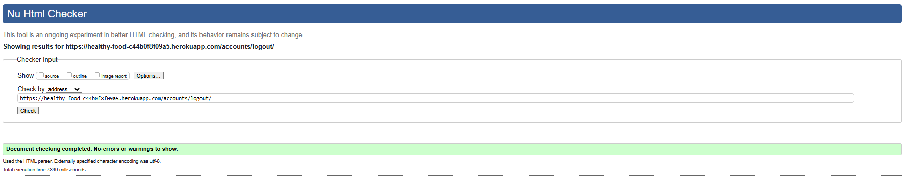
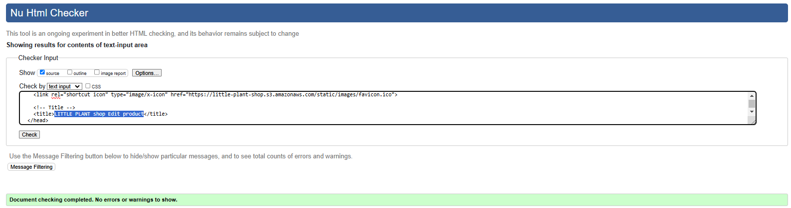
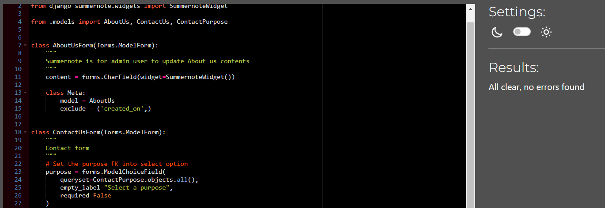
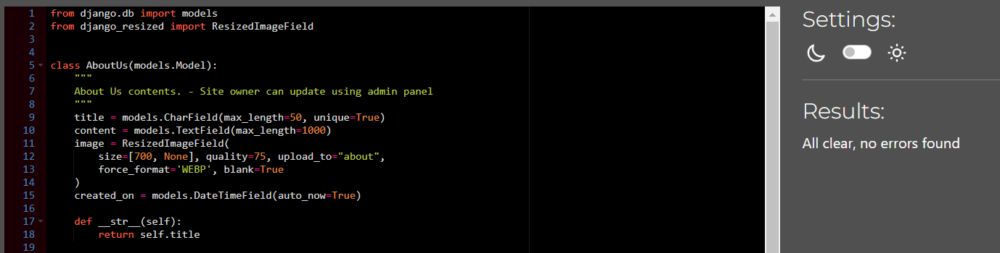
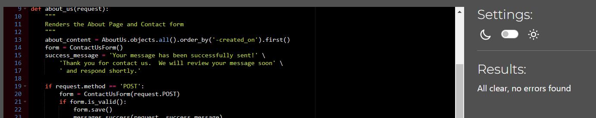
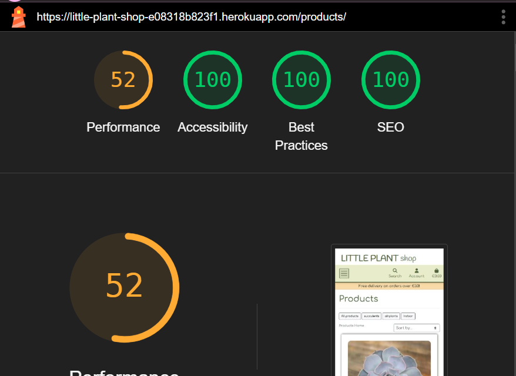
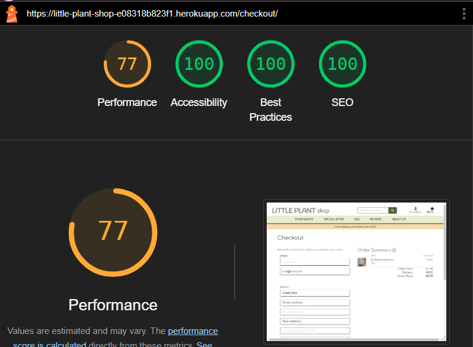
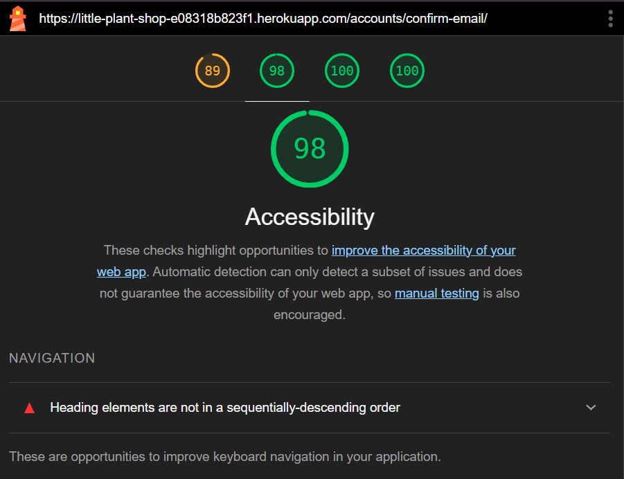

# Testing

## Code Validation

### HTML
| Page | W3C URL | Screenshot | Notes |
| --- | --- | --- | --- |
| Home | [W3C](https://validator.w3.org/nu/?doc=https%3A%2F%2Flittle-plant-shop-e08318b823f1.herokuapp.com%2F) |  | No Error |
| Sign-up | [W3C](https://validator.w3.org/nu/?doc=https%3A%2F%2Flittle-plant-shop-e08318b823f1.herokuapp.com%2Faccounts%2Fsignup%2F) |  | No Error |
| Log-in | [W3C](https://validator.w3.org/nu/?doc=https%3A%2F%2Flittle-plant-shop-e08318b823f1.herokuapp.com%2Faccounts%2Flogin%2F) |  | No Error ||
| Log-out | [W3C](https://validator.w3.org/nu/?doc=https%3A%2F%2Fhealthy-food-c44b0f8f09a5.herokuapp.com%2Faccounts%2Flogout%2F) |  | No Error |
| Products list | [W3C](https://validator.w3.org/nu/?doc=https%3A%2F%2Flittle-plant-shop-e08318b823f1.herokuapp.com%2Fproducts%2F) |  | No Error |
| Products detail | [W3C](https://validator.w3.org/nu/?doc=https%3A%2F%2Flittle-plant-shop-e08318b823f1.herokuapp.com%2Fproducts%2Fpachyveria-corvus) |  | No Error |
| FAQ | [W3C](https://validator.w3.org/nu/?doc=https%3A%2F%2Flittle-plant-shop-e08318b823f1.herokuapp.com%2Ffaq%2F%3Fcategory%3D1) |  | No Error |
| Reviews | [W3C](https://validator.w3.org/nu/?doc=https%3A%2F%2Flittle-plant-shop-e08318b823f1.herokuapp.com%2Fproducts%2Freview%2F) |  | No Error |
| About us | [W3C](https://validator.w3.org/nu/?doc=https%3A%2F%2Flittle-plant-shop-e08318b823f1.herokuapp.com%2Fabout%2F) |  | No Error |
| Privacy Policy | [W3C](https://validator.w3.org/nu/?doc=https%3A%2F%2Flittle-plant-shop-e08318b823f1.herokuapp.com%2Fabout%2Fprivacy-policy) |  | No Error |
| Profile | [W3C - Validated By Input](https://validator.w3.org/#validate_by_input) |  | No Error |
| Profile success | [W3C - Validated By Input](https://validator.w3.org/#validate_by_input) |  | No Error |
| Shopping bag | [W3C](https://validator.w3.org/nu/?doc=https%3A%2F%2Flittle-plant-shop-e08318b823f1.herokuapp.com%2Fbag%2F) |  | No Error |
| Checkout | [W3C](https://validator.w3.org/nu/?doc=https%3A%2F%2Flittle-plant-shop-e08318b823f1.herokuapp.com%2Fcheckout%2F) |  | No Error |
| Checkout success | [W3C](https://validator.w3.org/nu/?doc=https%3A%2F%2Flittle-plant-shop-e08318b823f1.herokuapp.com%2Fcheckout%2Fcheckout_success%2FA3CEB167CDEA4CAA8BC9A6F35FFB6440) |  | No Error |
| Profile | [W3C - Validated By Input](https://validator.w3.org/#validate_by_input) |  | No Error |
| Profile success | [W3C - Validated By Input](https://validator.w3.org/#validate_by_input) |  | No Error |
| Products add | [W3C - Validated By Input](https://validator.w3.org/#validate_by_input) |  | No Error |
| Products edit | [W3C - Validated By Input](https://validator.w3.org/#validate_by_input) |  | No Error |
| Newsletter | [W3C](https://validator.w3.org/nu/?doc=https%3A%2F%2Flittle-plant-shop-e08318b823f1.herokuapp.com%2Fnewsletter%2F) |  | No Error |
| Confirm email | [W3C - Validated By Input]() |  | No Error |
--

### CSS
| File | Jigsaw URL | Screenshot | Notes |
| --- | --- | --- | --- |
| base.css | [Jigsaw](https://jigsaw.w3.org/css-validator/validator?uri=https%3A%2F%2Flittle-plant-shop.s3.eu-west-1.amazonaws.com%2Fstatic%2Fcss%2Fbase.css&profile=css3svg&usermedium=all&warning=1&vextwarning=&lang=en) |  | No Error |
| checkout.css | [Jigsaw](https://jigsaw.w3.org/css-validator/validator?uri=https%3A%2F%2Flittle-plant-shop.s3.eu-west-1.amazonaws.com%2Fstatic%2Fcheckout%2Fcss%2Fcheckout.css&profile=css3svg&usermedium=all&warning=1&vextwarning=&lang=en) |  | No Error |
| faq-style.css | [Jigsaw](https://jigsaw.w3.org/css-validator/validator?uri=https%3A%2F%2Flittle-plant-shop.s3.eu-west-1.amazonaws.com%2Fstatic%2Ffaq%2Fcss%2Ffaq-style.css&profile=css3svg&usermedium=all&warning=1&vextwarning=&lang=en) |  |  |
| profile.css | [Jigsaw](https://jigsaw.w3.org/css-validator/validator?uri=https%3A%2F%2Flittle-plant-shop.s3.eu-west-1.amazonaws.com%2Fstatic%2Fprofiles%2Fcss%2Fprofile.css&profile=css3svg&usermedium=all&warning=1&vextwarning=&lang=en) |  |  |

### JavaScript
| File | Screenshot | Notes |
| --- | --- | --- |
| static/js/product-delete.js |  | --- |
| static/js/product-reviews-create-edit.js |  | --- |
| checkout/stripe_elements.js |  | --- |
| faq/accordion.js |  | --- |
| profile/country.js |  | --- |
| --- | --- | --- |

### Python

I have used the recommended [PEP8 CI Python Linter](https://pep8ci.herokuapp.com) to validate all of my Python files.  
**Project config**
| File | CI URL | Screenshot | Notes |
| --- | --- | --- | --- |
| asgi.py | [PEP8 CI] |  | No Error |
| settings.py | [PEP8 CI] |  | No Error |
| urls.py | [PEP8 CI] |  | No Error |
| views.py | [PEP8 CI] |  | No Error |  
| wsgi.py | [PEP8 CI] |  | No Error |  

**About us App**  
| File | CI URL | Screenshot | Notes |
| --- | --- | --- | --- |  
| admin.py | [PEP8 CI] |  | no Error |
| apps.py | [PEP8 CI] |  | No Error |
| forms.py | [PEP8 CI] |  | No Error |
| models.py | [PEP8 CI] |  | No Error |
| urls.py | [PEP8 CI] |  | No Error |
| views.py | [PEP8 CI] |  | No Error |

**Bag App**  
| File | CI URL | Screenshot | Notes |
| --- | --- | --- | --- |  
| apps.py | [PEP8 CI] |  | No Error |
| contexts.py | [PEP8 CI] |  | No Error |
| urls.py | [PEP8 CI] |  | No Error |
| views.py | [PEP8 CI] |  | No Error |
| templatetags/bag_tools.py | [PEP8 CI] |  | No Error |

**Checkout App**  
| File | CI URL | Screenshot | Notes |
| --- | --- | --- | --- |
| admin.py | [PEP8 CI] |  | No Error |
| apps.py | [PEP8 CI] |  | No Error |
| forms.py | [PEP8 CI] |  | No Error |
| models.py | [PEP8 CI] |  | No Error |
| signals.py | [PEP8 CI] |  | No Error |
| urls.py | [PEP8 CI] |  | No Error |
| views.py | [PEP8 CI] |  | No Error |
| webhook_handler.py | [PEP8 CI] |  | No Error |
| webhooks.py | [PEP8 CI] |  | No Error |

**FAQ App**  
| File | CI URL | Screenshot | Notes |
| --- | --- | --- | --- |  
| admin.py | [PEP8 CI] |  | No Error |
| apps.py | [PEP8 CI] |  | No Error |
| models.py | [PEP8 CI] |  | No Error |
| urls.py | [PEP8 CI] |  | No Error |
| views.py | [PEP8 CI] |  | No Error |

**Home App**  
| File | CI URL | Screenshot | Notes |
| --- | --- | --- | --- |  
| apps.py | [PEP8 CI] |  | No Error |
| urls.py | [PEP8 CI] |  | No Error |
| views.py | [PEP8 CI] |  | No Error |

**Newsletter App**  
| File | CI URL | Screenshot | Notes |
| --- | --- | --- | --- |  
| admin.py | [PEP8 CI] |  | No Error |
| apps.py | [PEP8 CI] |  | No Error |
| forms.py | [PEP8 CI] |  | No Error |
| models.py | [PEP8 CI] |  | No Error |
| urls.py | [PEP8 CI] |  | No Error |
| views.py | [PEP8 CI] |  | No Error |

**Products App**  
| File | CI URL | Screenshot | Notes |
| --- | --- | --- | --- |  
| admin.py | [PEP8 CI] |  | No Error |
| apps.py | [PEP8 CI] |  | No Error |
| forms.py | [PEP8 CI] |  | No Error |
| models.py | [PEP8 CI] |  | No Error |
| urls.py | [PEP8 CI] |  | No Error |
| views.py | [PEP8 CI] |  | No Error |
| widgets.py | [PEP8 CI] |  | No Error |  

**Profile App**  
| File | CI URL | Screenshot | Notes |
| --- | --- | --- | --- |  
| apps.py | [PEP8 CI] |  | No Error |
| forms.py | [PEP8 CI] |  | No Error |
| models.py | [PEP8 CI] |  | No Error |
| urls.py | [PEP8 CI] |  | No Error |
| views.py | [PEP8 CI] |  | No Error |

| File | CI URL | Screenshot | Notes |
| --- | --- | --- | --- | 
| custom_storages.py | [PEP8 CI] |  | No Error |

## Browser Compatibility

I've tested my deployed project on multiple browsers.

| Browser | Screenshot | Notes |
| --- | --- | --- |
| Chrome |  | No Errors |
| Firefox |  | No Errors |
| Edge |  | No Errors |
| Safari |  | No Errors |
| Opera |  | No Errors |  

## Responsiveness

I've tested my deployed project on multiple devices.

| Device | Screenshot | Notes |
| --- | --- | --- |
| Mobile |  | No Errors | 
| Tablet (DevTools) |  | No Errors | 
| Laptop 16" |  | No Errors | 
| Desktop 21.5" |  | No Errors | 
| 4K Monitor 40" |  | No Errors |   

## Lighthouse Audit

I've tested my deployed project using the Lighthouse Audit tool.

### Desktop
| Page | Size | Screenshot | Notes |
| --- | --- | --- | --- |
| Home | Desktop |  |  |
| Register | Desktop |  |  |
| Sign in | Desktop |  |  |
| Sign out | Desktop |  |  |
| Product list | Desktop |  |  |
| Product detail | Desktop |  |  |
| FAQ | Desktop |  |  |
| Reviews | Desktop |  |  |
| About us | Desktop |  |  |
| Privacy policy | Desktop |  |  |
| Profile | Desktop |  |  |
| Profile success | Desktop |  |  |
| Shopping bag | Desktop |  |  |
| Checkout | Desktop |  |  |
| Checkout success | Desktop |  |  |
| Product add | Desktop |  |  |
| Product edit | Desktop |  |  |
| Newsletter | Desktop |  |  |
| Confirm mail | Desktop |  |  |

### Mobile  
| Page | Size | Screenshot | Notes |
| --- | --- | --- | --- |
| Home | Mobile |  |  |
| Register | Mobile |  |  |
| Sign in | Mobile |  |  |
| Sign out | Mobile |  |  |
| Product list | Mobile |  |  |
| Product detail | Mobile |  |  |
| FAQ | Mobile |  |  |
| Reviews | Mobile |  |  |
| About us | Mobile |  |  |
| Privacy policy | Mobile |  |  |
| Profile | Mobile |  |  |
| Profile success | Mobile |  |  |
| Shopping bag | Mobile |  |  |
| Checkout | Mobile |  |  |
| Checkout success | Mobile |  |  |
| Product add | Mobile |  |  |
| Product edit | Mobile |  |  |
| Newsletter | Mobile |  |  |
| Confirm mail | Mobile |  |  |

## Defensive Programming

Defensive programming was manually tested with the below user acceptance testing:

| Home Page | User Action | Expected Result | Pass/Fail | Comments |
| --- | --- | --- | --- | --- |
| Nav links | Click on Logo | Redirection to Home page | Pass | |
| | Click on Profile icon in navbar  | Display dropdown list | Pass | |
| | Click on Register | Redirection to Sign in page | Pass | |
| | Click on Login | Redirection to Login page | Pass | |
| | Click on Product management | Redirection to Product add page | Pass | |
| | Click on My profile | Redirection to Profile page | Pass | |
| | Click on Logout | Redirection to Logout page | Pass | |
| | Click on Bag icon  | Redirection to shopping bag page | Pass | |
| | Hover on links  | shows hover color | Pass | |
| Authenticated user only | under the profile icon | User name is displayed under | Pass | |
| | Click on SHOP PLANTS | Display dropdown list | Pass | |
| | Click on All Products | Redirection to products page | Pass | |
| | Click on each category name | Filtered products with each category | Pass | |
| | Click on SPECIAL OFFER | Filtered with sale_price has valid price | Pass | |
| | Click on FAQ | Display dropdown list | Pass | |
| | Click on FAQ each category | Filtered FAQ with each category | Pass | |
| | Click on REVIEWS  | Display dropdown list | Pass | |
| | Click on REVIEWS All Products | Redirection to Review page | Pass | |
| | Click on REVIEWS each category | Filtered with each category | Pass | |

## User story Testing
| Epic | User Story ID | AS A/AN | I WANT TO BE ABLE TO ... | SO THAT I CAN ... |
|-|-|-|-|-|
| Environment Configuration	| Create project structure | Developer | Create the project structure | Start develop this project |
|-| Install crispy and other modules | Developer | Set up other useful modules | Use forms and images easily |
|-| Connect CI database | Developer | Set up Database - SQLite3 and PosgreSQL | Prepare to use both in case testings or problems |
| Home app | Create homepage app and index template | Developer | Create homepage app and template | Runserver to check the page in browser preview|
|-| Create Navigation bar and footer | Site User | Find the site content's links instinctively | Easily navigate through to find contents |
|-| Sort the product list by categories and sale | Site User | Quickly identify categories and special offers | Take advantage of special savings on products I'd like to purchase |
|-| The current login status is reflected to status mention area | Site User | See my logging-in account name | Aware of my account logging in status |
|-| Newsletter's form - footer | Site User | Find Newsletter form | Apply it from all the pages |
| User Authentication | User Registration |	New Site User | Register an account | Store my personal information for easier shopping next time |
|-| User Log in / Log out | Site User | Easily login or logout | Access my personal account information |
|-| Reset Password | Site User | Easily recover my password in case I forget it | Recover access to  my account |
|-| Email confirm - Registration | Site User | Receive an email confirmation after registering | Verify that my account registration was successful |
| Product app | Product List view | Site User | View all available products | Find out some products that I can compare and choose |
|-| Product detail view | Site User | View the specific product's information | Inspect the details before purchasing it |
|-| Product create | Administrator | Create the new product | it will be added to the list page |
|-| Product edit | Administrator | Edit the product | To manage the products |
|-| Product delete | Administrator | Delete the product | To manage the products |
| Profile app | Store and edit personal information | Site User | Store personal information | Prefill those for my future orders |
|-| Store my past order records | Site User | Store my past order records | Ensure my new order is sent to the system properly |
| User Experiense | Clear visual information and title | Site User | clearly understand what services are offered on this website | View the site with a purpose |
|-| Attractive Carousel | Site Owner | Show some nice contents to attract site users | Guide Site users to visit those pages |
|-| Toasts notification | Site User | Rceive the notification on screen from my action | Ensure that my action is valid |
|-| Breadcrumb | Site User | Know where I am now and how to go back to other pages | Freely move around to the desired pages |
|-| Pagination for the query data | Site User | Use page navigation for query data | View next page of the same query |
|Product Reviews| Create Reviews, Special-offer and other templates | Developer | Provide templates and views for reviews and special offers | Pages can be created from product filtering |
| About us app | Create About us app, template | Site Owner | clearly convey who we are	| Give users a sense of trust and confidence |
|-| About us - Contact form	| Site User | Use the simple easy form | Send my query easily through the contact form |
|-| Admin - Query list | Administrator | View all queries and select box for change status | manage multiple customer queries |
|-| Admin - Query detail | Administrator | View indivisual query and reply the message by email	| Change status or delete the query |
| Sorthing | Category sorting | Site User | Sort the specific category of product | Find the best product in a specific category |
|-| Product search bar | Site User | Search for a product by name or description | Find a specific product that I'm looking for |
|-| Search result | Site User | Easily see what I've searched for and the number of results | Quickly decide whether the product I want is available |  
--  