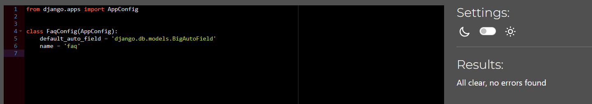
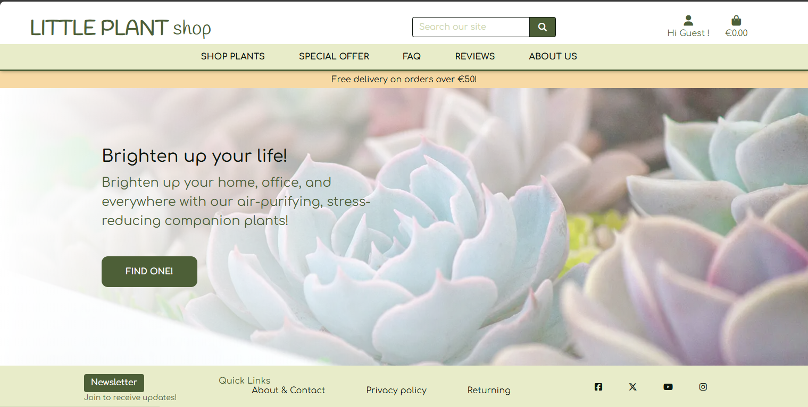
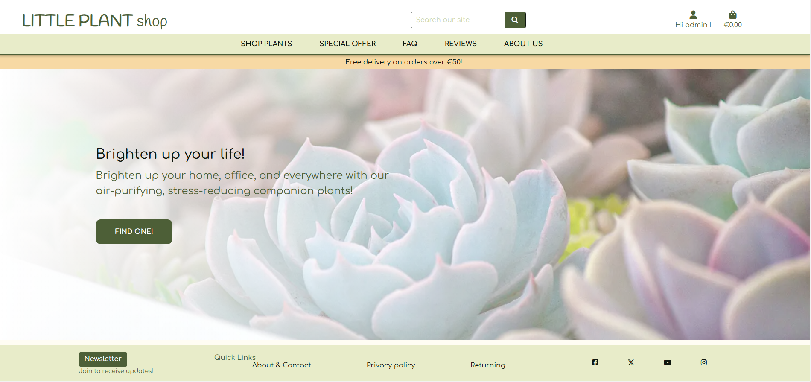
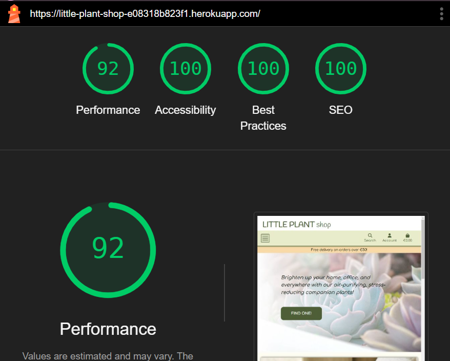
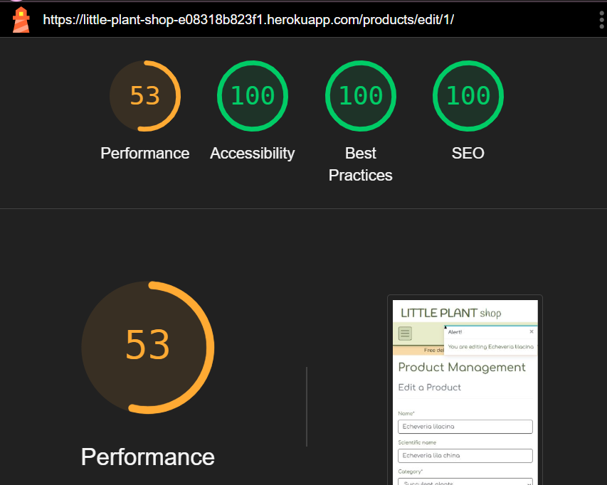

# Testing

## Code Validation

### HTML
| Page | W3C URL | Screenshot | Notes |
| --- | --- | --- | --- |
| Home | [W3C](https://validator.w3.org/nu/?doc=https%3A%2F%2Flittle-plant-shop-e08318b823f1.herokuapp.com%2F) |  | No Error |
| Sign-up | [W3C](https://validator.w3.org/nu/?doc=https%3A%2F%2Flittle-plant-shop-e08318b823f1.herokuapp.com%2Faccounts%2Fsignup%2F) |  | No Error |
| Log-in | [W3C](https://validator.w3.org/nu/?doc=https%3A%2F%2Flittle-plant-shop-e08318b823f1.herokuapp.com%2Faccounts%2Flogin%2F) |  | No Error ||
| Log-out | [W3C](https://validator.w3.org/nu/?doc=https%3A%2F%2Fhealthy-food-c44b0f8f09a5.herokuapp.com%2Faccounts%2Flogout%2F) |  | No Error |
| Products list | [W3C](https://validator.w3.org/nu/?doc=https%3A%2F%2Flittle-plant-shop-e08318b823f1.herokuapp.com%2Fproducts%2F) |  | No Error |
| Products detail | [W3C](https://validator.w3.org/nu/?doc=https%3A%2F%2Flittle-plant-shop-e08318b823f1.herokuapp.com%2Fproducts%2Fpachyveria-corvus) |  | No Error |
| FAQ | [W3C](https://validator.w3.org/nu/?doc=https%3A%2F%2Flittle-plant-shop-e08318b823f1.herokuapp.com%2Ffaq%2F%3Fcategory%3D1) |  | No Error |
| Reviews | [W3C](https://validator.w3.org/nu/?doc=https%3A%2F%2Flittle-plant-shop-e08318b823f1.herokuapp.com%2Fproducts%2Freview%2F) |  | No Error |
| About us | [W3C](https://validator.w3.org/nu/?doc=https%3A%2F%2Flittle-plant-shop-e08318b823f1.herokuapp.com%2Fabout%2F) |  | No Error |
| Privacy Policy | [W3C](https://validator.w3.org/nu/?doc=https%3A%2F%2Flittle-plant-shop-e08318b823f1.herokuapp.com%2Fabout%2Fprivacy-policy) |  | No Error |
| Profile | [W3C - Validated By Input](https://validator.w3.org/#validate_by_input) |  | No Error |
| Profile success | [W3C - Validated By Input](https://validator.w3.org/#validate_by_input) |  | No Error |
| Shopping bag | [W3C](https://validator.w3.org/nu/?doc=https%3A%2F%2Flittle-plant-shop-e08318b823f1.herokuapp.com%2Fbag%2F) |  | No Error |
| Checkout | [W3C](https://validator.w3.org/nu/?doc=https%3A%2F%2Flittle-plant-shop-e08318b823f1.herokuapp.com%2Fcheckout%2F) |  | No Error |
| Checkout success | [W3C](https://validator.w3.org/nu/?doc=https%3A%2F%2Flittle-plant-shop-e08318b823f1.herokuapp.com%2Fcheckout%2Fcheckout_success%2FA3CEB167CDEA4CAA8BC9A6F35FFB6440) |  | No Error |
| Profile | [W3C - Validated By Input](https://validator.w3.org/#validate_by_input) |  | No Error |
| Profile success | [W3C - Validated By Input](https://validator.w3.org/#validate_by_input) |  | No Error |
| Products add | [W3C - Validated By Input](https://validator.w3.org/#validate_by_input) |  | No Error |
| Products edit | [W3C - Validated By Input](https://validator.w3.org/#validate_by_input) |  | No Error |
| Newsletter | [W3C](https://validator.w3.org/nu/?doc=https%3A%2F%2Flittle-plant-shop-e08318b823f1.herokuapp.com%2Fnewsletter%2F) |  | No Error |
| Confirm email | [W3C - Validated By Input]() |  | No Error |
---

### CSS
| File | Jigsaw URL | Screenshot | Notes |
| --- | --- | --- | --- |
| base.css | [Jigsaw](https://jigsaw.w3.org/css-validator/validator?uri=https%3A%2F%2Flittle-plant-shop.s3.eu-west-1.amazonaws.com%2Fstatic%2Fcss%2Fbase.css&profile=css3svg&usermedium=all&warning=1&vextwarning=&lang=en) |  | No Error |
| checkout.css | [Jigsaw](https://jigsaw.w3.org/css-validator/validator?uri=https%3A%2F%2Flittle-plant-shop.s3.eu-west-1.amazonaws.com%2Fstatic%2Fcheckout%2Fcss%2Fcheckout.css&profile=css3svg&usermedium=all&warning=1&vextwarning=&lang=en) |  | No Error |
| faq-style.css | [Jigsaw](https://jigsaw.w3.org/css-validator/validator?uri=https%3A%2F%2Flittle-plant-shop.s3.eu-west-1.amazonaws.com%2Fstatic%2Ffaq%2Fcss%2Ffaq-style.css&profile=css3svg&usermedium=all&warning=1&vextwarning=&lang=en) |  |  |
| profile.css | [Jigsaw](https://jigsaw.w3.org/css-validator/validator?uri=https%3A%2F%2Flittle-plant-shop.s3.eu-west-1.amazonaws.com%2Fstatic%2Fprofiles%2Fcss%2Fprofile.css&profile=css3svg&usermedium=all&warning=1&vextwarning=&lang=en) |  |  |

### JavaScript
| File | Screenshot | Notes |
| --- | --- | --- |
| static/js/product-delete.js |  | --- |
| static/js/product-reviews-create-edit.js |  | --- |
| checkout/stripe_elements.js |  | --- |
| faq/accordion.js |  | --- |
| profile/country.js |  | --- |
| --- | --- | --- |

### Python

I have used the recommended [PEP8 CI Python Linter](https://pep8ci.herokuapp.com) to validate all of my Python files.  
**Project config**
| File | CI URL | Screenshot | Notes |
| --- | --- | --- | --- |
| asgi.py | [PEP8 CI] |  | No Error |
| settings.py | [PEP8 CI] |  | No Error |
| urls.py | [PEP8 CI] |  | No Error |
| views.py | [PEP8 CI] |  | No Error |  
| wsgi.py | [PEP8 CI] |  | No Error |  

**About us App**  
| File | CI URL | Screenshot | Notes |
| --- | --- | --- | --- |  
| admin.py | [PEP8 CI] |  | no Error |
| apps.py | [PEP8 CI] |  | No Error |
| forms.py | [PEP8 CI] |  | No Error |
| models.py | [PEP8 CI] |  | No Error |
| urls.py | [PEP8 CI] |  | No Error |
| views.py | [PEP8 CI] |  | No Error |

**Bag App**  
| File | CI URL | Screenshot | Notes |
| --- | --- | --- | --- |  
| apps.py | [PEP8 CI] |  | No Error |
| contexts.py | [PEP8 CI] |  | No Error |
| urls.py | [PEP8 CI] |  | No Error |
| views.py | [PEP8 CI] |  | No Error |
| templatetags/bag_tools.py | [PEP8 CI] |  | No Error |

**Checkout App**  
| File | CI URL | Screenshot | Notes |
| --- | --- | --- | --- |
| admin.py | [PEP8 CI] |  | No Error |
| apps.py | [PEP8 CI] |  | No Error |
| forms.py | [PEP8 CI] |  | No Error |
| models.py | [PEP8 CI] |  | No Error |
| signals.py | [PEP8 CI] |  | No Error |
| urls.py | [PEP8 CI] |  | No Error |
| views.py | [PEP8 CI] |  | No Error |
| webhook_handler.py | [PEP8 CI] |  | No Error |
| webhooks.py | [PEP8 CI] |  | No Error |

**FAQ App**  
| File | CI URL | Screenshot | Notes |
| --- | --- | --- | --- |  
| admin.py | [PEP8 CI] |  | No Error |
| apps.py | [PEP8 CI] |  | No Error |
| models.py | [PEP8 CI] |  | No Error |
| urls.py | [PEP8 CI] |  | No Error |
| views.py | [PEP8 CI] |  | No Error |

**Home App**  
| File | CI URL | Screenshot | Notes |
| --- | --- | --- | --- |  
| apps.py | [PEP8 CI] |  | No Error |
| urls.py | [PEP8 CI] |  | No Error |
| views.py | [PEP8 CI] |  | No Error |

**Newsletter App**  
| File | CI URL | Screenshot | Notes |
| --- | --- | --- | --- |  
| admin.py | [PEP8 CI] |  | No Error |
| apps.py | [PEP8 CI] |  | No Error |
| forms.py | [PEP8 CI] |  | No Error |
| models.py | [PEP8 CI] |  | No Error |
| urls.py | [PEP8 CI] |  | No Error |
| views.py | [PEP8 CI] |  | No Error |

**Products App**  
| File | CI URL | Screenshot | Notes |
| --- | --- | --- | --- |  
| admin.py | [PEP8 CI] |  | No Error |
| apps.py | [PEP8 CI] |  | No Error |
| forms.py | [PEP8 CI] |  | No Error |
| models.py | [PEP8 CI] |  | No Error |
| urls.py | [PEP8 CI] |  | No Error |
| views.py | [PEP8 CI] |  | No Error |
| widgets.py | [PEP8 CI] |  | No Error |  

**Profile App**  
| File | CI URL | Screenshot | Notes |
| --- | --- | --- | --- |  
| apps.py | [PEP8 CI] |  | No Error |
| forms.py | [PEP8 CI] |  | No Error |
| models.py | [PEP8 CI] |  | No Error |
| urls.py | [PEP8 CI] |  | No Error |
| views.py | [PEP8 CI] |  | No Error |

| File | CI URL | Screenshot | Notes |
| --- | --- | --- | --- | 
| custom_storages.py | [PEP8 CI] |  | No Error |

## Browser Compatibility

I've tested my deployed project on multiple browsers.

| Browser | Screenshot | Notes |
| --- | --- | --- |
| Chrome |  | No Errors |
| Firefox |  | No Errors |
| Edge |  | No Errors |
| Safari |  | No Errors |
| Opera |  | No Errors |  

## Responsiveness

I've tested my deployed project on multiple devices.

| Device | Screenshot | Notes |
| --- | --- | --- |
| Mobile |  | No Errors | 
| Tablet (DevTools) |  | No Errors | 
| Laptop 16" |  | No Errors | 
| Desktop 21.5" |  | No Errors | 
| 4K Monitor 40" |  | No Errors |   

## Lighthouse Audit

I've tested my deployed project using the Lighthouse Audit tool.

### Desktop
| Page | Size | Screenshot | Notes |
| --- | --- | --- | --- |
| Home | Desktop |  |  |
| Sign up | Desktop |  | Headings are not sequential order |
| Sign in | Desktop |  | Headings are not sequential order |
| Sign out | Desktop |  | Headings are not sequential order |
| Product list | Desktop |  |  |
| Product detail | Desktop |  |  |
| FAQ | Desktop |  |  |
| Reviews | Desktop |  |  |
| About us | Desktop |  |  |
| Privacy policy | Desktop |  | Headings are not sequential order and text colour |
| Profile | Desktop |  |  |
| Profile success | Desktop |  |  |
| Shopping bag | Desktop |  | Headings is not sequential order |
| Checkout | Desktop |  |  |
| Checkout success | Desktop |  | Headings is not sequential order |
| Product add | Desktop |  |  |
| Product edit | Desktop |  |  |
| Newsletter | Desktop |  |  |
| Confirm mail | Desktop |  | Headings is not sequential order |
* Headings is not sequential order  
Most of the pages with this issue, fixed to create or change headings though, I didn't have time to do all the pages to adjust this issue.  

### Mobile  
| Page | Size | Screenshot | Notes |
| --- | --- | --- | --- |
| Home | Mobile |  |  |
| Register | Mobile |  | Headings order |
| Sign in | Mobile |  | Headings order |
| Sign out | Mobile |  | Headings order |
| Product list | Mobile |  |  |
| Product detail | Mobile |  |  |
| FAQ | Mobile |  |  |
| Reviews | Mobile |  |  |
| About us | Mobile |  |  |
| Privacy policy | Mobile |  | Headings order and color |
| Profile | Mobile |  |  |
| Profile success | Mobile |  |  |
| Shopping bag | Mobile |  | Headings order |
| Checkout | Mobile |  | Stripe's performance |
| Checkout success | Mobile |  | Headings order |
| Product add | Mobile |  |  |
| Product edit | Mobile |  |  |
| Newsletter | Mobile |  |  |
| Confirm mail | Mobile |  | Headings order |

## Defensive Programming

Defensive programming was manually tested with the below user acceptance testing:

| Home Page | User Action | Expected Result | Pass/Fail | Comments |
| --- | --- | --- | --- | --- |
| Nav links | Click on Logo | Redirection to Home page | Pass | |
| | Click on Profile icon in navbar  | Display dropdown list | Pass | |
| | Click on `Register` | Redirection to Sign up page | Pass | |
| | Click on `Login` | Redirection to Login page | Pass | |
| | Click on Bag icon  | Redirection to shopping bag page | Pass | |
| | Hover on links  | shows hover color | Pass | |
| | Click on `SHOP PLANTS` | Display dropdown list | Pass | |
| | Click on `All Products` | Redirection to products page | Pass | |
| | Click on each category name | Filtered products with each category | Pass | |
| | Click on `SPECIAL OFFER` | Filtered with sale_price has valid price | Pass | |
| | Click on `FAQ` | Display dropdown list | Pass | |
| | Click on `FAQ` each category | Filtered FAQ with each category | Pass | |
| | Click on `REVIEWS`  | Display dropdown list | Pass | |
| | Click on `REVIEWS` All Products | Redirection to Review page | Pass | |
| | Click on `REVIEWS` each category | Filtered with each category | Pass | |
| | Click on `ABOUT US` | Redirection to about us page | Pass | |
|Search bar input| Input keyword | Filter products that contain in name and description | Pass | |
| | submit with no keyword | Toast : worning | Pass | |
|Main section| Click on `FIND ONE!` button | Redirection to All products page  | Pass | |
|Carousel-Bootstrap| Click on Each pictures | Redirection to product's each category page | Pass | |
|footer| Click on `Newsletter` | Redirection to Newsletter page | Pass | |
| | Click on `About & Contact` | Redirection to About us page | Pass | |
| | Click on `Privacy policy` | Redirection to Privacy policy page | Pass | |
| | Click on `Returning` | Redirection to FAQ Returning page | Pass | |
| | Click on each SNS link | Redirection to each page with new tab | Pass | |
|Authenticated  only | under the profile icon | User name is displayed under | Pass | |
|Authenticated  only | Click on `My profile` | Redirection to Profile page | Pass | |
|Authenticated  only | Showed and click on `Logout` | Redirection to Logout page | Pass | |
| Administrator only| Showed and click on `Product management` | Redirection to Product add page | Pass | |
---

| Product Page | User Action | Expected Result | Pass/Fail | Comments |
| --- | --- | --- | --- | --- |
|Category quick link | Click on those categories | Redirection to those pages and display which category and how many results | Pass | |
| | Click on sorthing dropdown | sorting the products by sort key | Pass | price, name, category |
| | Click on sorthing dropdown | sorting the products by sort key | Not Pass | rating |
| | Click on each card of product | Redirection to product details page | Pass |  |
|Administrator only | Click on Edit button on product | Redirection to edit page | Pass | |
| | Click on Delet button | Open delete modal to confirm to delete | Pass | |
---

| Product details Page | User Action | Expected Result | Pass/Fail | Comments |
| --- | --- | --- | --- | --- |
|Breadcrumb | Click on `Home` | Redirection to Home | Pass | |
| | Click on `All products` | Redirection to All products | Pass | |
| | Click on category tag | Redirection to category filtered products list | Pass | |
| | Click on Add quantity | Add number  | Pass | |
| | Click on more than 99 | Not add anymore | Pass | |
| | Click on reduce quantity | Reduce number | Pass | |
| | Click on less than 1 | Not Reduce number anymore | Pass | |
| | Input on textbox more than 99 | Add to bag button warning | Pass | |
| | Delete the number in textbox | expect  Add to bag button warning | Not Pass | Server 500 error |
| | Click on `KEEP SHOPPING` | Redirection to All products | Pass | |
| | Click on `ADD TO BAG` 1-99 | the product and quantity went in bag and toast notified  | Pass | |
| | Click on `GO to SECURE CHECKOUT` in toast notification | Redirection to shopping bag page | Pass | |
| | Click on close button `x` in toast notification | Close the notification | Pass | |
|Authenticated only | Click on `Contribute your review` | Open the review modal and empty form with default star value 1| Pass | |
|Authenticated only| Click on `Close` `x` button | Close the modal | Pass | |
|Authenticated only| Hove over and Click on star rating | Select the rating value | Pass | |
|Authenticated only | Click on `submit` without fill any text | warning to fill text | Pass | |
|Authenticated only| Click on `submit`with chooseing image file | Update comment, rating, and image file | Pass | |
|Authenticated only | Review submission trigger toast notified | Notified but It should be no shopping bags to show | Not Pass | |
|Authenticated and own review | Click on edit button | Opens the edit modal with filled own rating | Pass | *BuUpdate pwn value, rating and file | Redirection to  | Pass | |
|Authenticated and own review| Click on `Close``x` | Close the modal  | Pass | |
|Authenticated and own review| Click on  | Redirection to  | Pass | |
|Authenticated and own review | Click on `Delete` | Delete confirmation modal open | Pass | |
|Authenticated and own review | Click on `Close``x` | Close the modal | Pass | |
|Authenticated and own review | Click on `Delete`in delete modal | Delete the review | Pass | |
|Authenticated and own review | Click on `Contribute your review` secondtime or already wrote | Prevent new form create and fill the own review data & rating  | Pass | |
|Administrator only | Click on Product's `Edit` | Redirection to Products Management page | Pass | |
|Administrator only | Click on Product's `Delete` | Delete confirmation modal open  | Pass | |
|Administrator only | Click on `Close``x` | Close the modal | Pass | |
|Administrator only | Click on `Delete`in delete modal | Delete the review | Pass | |
---

| FAQ Page | User Action | Expected Result | Pass/Fail | Comments |
| --- | --- | --- | --- | --- |
|Category quick link | Click on those categories | Rebuild the FAQ contents by selected category(filter) | Pass | |
| | Click on Questions | open up the accordion box and show answer  | Pass | |
---

| About Contact Page | User Action | Expected Result | Pass/Fail | Comments |
| --- | --- | --- | --- | --- |
| | Click on submit button without fill | warning to fill | Pass | |
| | inpput non email format text to email field  | warning to fill email address | Pass | |
| | Empty user name | waring to fill | Pass | |
| | No select purpose | waring to select purpose | Pass | |
| | Empty message  | waring to fill message | Pass | |
| | Input all valid text and submit | Toast notified success and I can receive the email | Pass | |
|Authenticated only| When access this page | Mail field is prefilled | Pass | |
---

| Newsletter Page | User Action | Expected Result | Pass/Fail | Comments |
| --- | --- | --- | --- | --- |
| | Click on submit button without fill | warning to fill | Pass | |
| | inpput non email format text to email field  | warning to fill email address | Pass | |
| | Input all valid text and submit | Toast notified success and I can receive the email | Pass | |
|Authenticated only| When access this page | Mail field is prefilled | Pass | |
---

| Profile Page | User Action | Expected Result | Pass/Fail | Comments |
| --- | --- | --- | --- | --- |
| |Input any number charactor or mark and `UPDATE INFORMATION` | Update the data and Toast notified | Pass | |
| | Delete the formaer data and `UPDATE INFORMATION` | Update the data and Toast notified the past order page | Pass | |
| | Click on past order number | Redirection to past order details page and toast notifide  | Pass | |
| | Click on `BACK TO PROFILE` | Redirection to Profile page | Pass | |
|If data exists | Each individual field | Prefill the data | Pass | |
---
To manage/organize data freely for user, there is no required field or validation

| Shopping Page | User Action | Expected Result | Pass/Fail | Comments |
| --- | --- | --- | --- | --- |
| | Quantity button increase, when input over 99 | stop adding | Pass | |
| | Quantity button decrease, when input become 1 | stop rducing | Pass | |
| | `Update` button with any number | Update the shopping bag | Pass | |
| | remove number or no number input `Update` | Server 500 error | Pass | |
| | `remove` button | Remove the product and Toast notified | Pass | |
| | `SECURE CHECKOUT` | Redirection to Checkout page | Pass | |
---

| Checkout Page | User Action | Expected Result | Pass/Fail | Comments |
| --- | --- | --- | --- | --- |
| | Full name field required, without filling `Complese Order` | Warning to fill Full name | Pass | |
| | email field required, without filling `Complese Order` | Warning to fill email name | Pass | |
| | Phone number field required, without filling `Complese Order` | Warning to fill Phone number | Pass | |
| | Street address field required, without filling `Complese Order` | Warning to fill Street address | Pass | |
| | Town address field required, without filling `Complese Order` | Warning to fill Town address | Pass | |
| | Country field required, without choose any country `Complese Order` | Warning to choose country | Pass | |
| | Invalid credit card number  | Warning beloe | Pass | |
| | Click on `Adjust Bag` | Redirection to Bag page | Pass | |
| | Click on `Complese Order` | Redirection to success page and Toast notified | Pass | |
| | Click on `NOW CHECKOUT THE SPECIAL OFFER` | Redirection to product on sale product | Pass | |
---
| SNS link | User Action | Expected Result | Pass/Fail | Comments |
| --- | --- | --- | --- | --- |
| | Click on Facebook | Redirection to Facebook in new tub | Pass | |
| | Click on Twitter/X | Redirection to Twitter/X in new tub | Pass | |
| | Click on Youtube | Redirection to Youtube in new tub | Pass | |
| | Click on instagram | Redirection to Facinstagram in new tub | Pass | |

## Automation Python testing
I really didn't have time so I could do only Review model testing.
The testing file is in products app. /products/test.py

## User story Testing
| Epic | User Story ID | AS A/AN | I WANT TO BE ABLE TO ... | SO THAT I CAN ... |
|-|-|-|-|-|
| 1 Page templates and navigations	| User Story - Create project structure [#1](https://github.com/AtsukoCoffey/little_plant/issues/1) | Developer | Create the project structure | Start develop this project |
|-| Create navigation bar and footer [#2](https://github.com/AtsukoCoffey/little_plant/issues/2) |Site user| Find the site content's links instinctively | Easily navigate through to find contents |
|-| Create homepage app and index template [#6](https://github.com/AtsukoCoffey/little_plant/issues/6) | Developer | Create homepage app and template |  Run server to check the page in browser |
|-| Connect CI database [#3](https://github.com/AtsukoCoffey/little_plant/issues/3) | Developer | Set up Database - SQLite3 and PosgreSQ | Prepare to use both in case of problems|
|-|Preparing for Deployment [#5](https://github.com/AtsukoCoffey/little_plant/issues/5) | Developer | prepare for deployment | up load to Heroku and can be seen publicly |
|2 User Authentication | User registration and other pages layout [#14](https://github.com/AtsukoCoffey/little_plant/issues/14) | Site user | use the same navigation design in authentication pages | avoid the confusion |
|-| Reset Password [#12](https://github.com/AtsukoCoffey/little_plant/issues/12) | Site user | Easily recover my password in case I forget it | Recover access to my account |
|-| User Registration [#10](https://github.com/AtsukoCoffey/little_plant/issues10/) | New site user | Register an account |  Store my personal information for easier shopping next time |
|-| User Log in / Log out [#11](https://github.com/AtsukoCoffey/little_plant/issues/11) | Site user | Easily login or logout | Access my personal account information |
|-| Email confirm - Registration [#13](https://github.com/AtsukoCoffey/little_plant/issues/13) | Site user | Receive an email confirmation after registering | Verify that my account registration |
|-| The current login status is reflected to status mention [#8](https://github.com/AtsukoCoffey/little_plant/issues/8) | Site user | See my logging-in account name | Aware of my account logging in status |
|3 Site Products| Prepare products [#15](https://github.com/AtsukoCoffey/little_plant/issues/15) | Developer | prepare the products app | start to add some products |
|-| Product detail view [#16](https://github.com/AtsukoCoffey/little_plant/issues/16) | Site user | View the specific product's information | Inspect the details before purchasing it |
|-|  Category filtering [#20](https://github.com/AtsukoCoffey/little_plant/issues/20) | Site user | filter the specific category of product | Find the best product in a specific category |
|-| Product search bar [#21](https://github.com/AtsukoCoffey/little_plant/issues/21) | Site user | Search for a product by name or description | Find a specific product that I'm looking for |
|-| Sorting dropdown in product list view [#22](https://github.com/AtsukoCoffey/little_plant/issues/22) | Site user | Easily see what I've searched for and the number of results | Quickly decide whether the product I want is available |
|-| Sort the product list by categories and sale [#7](https://github.com/AtsukoCoffey/little_plant/issues/7) | Site user | Quickly identify categories and special offers | Take advantage of special savings on products I'd like to purchase |
|-| Product create [#17](https://github.com/AtsukoCoffey/little_plant/issues/17) | Administrator | Create the new product | It will be added to the list page |
|-| Product edit [#18](https://github.com/AtsukoCoffey/little_plant/issues/18) | Administrator | Edit the product | Manage the products |
|-| Product delete [#19](https://github.com/AtsukoCoffey/little_plant/issues/19) | Administrator | Delete the product | Manage the products |
|-| For Site owner there are EDIT and DELETE button [#32](https://github.com/AtsukoCoffey/little_plant/issues/32) | - | - | - |
|-| Product CRUD extra security [#38](https://github.com/AtsukoCoffey/little_plant/issues/38) | Developer | Set the extra security on those CRUD pages | prevent the access from not permitted person |
|-| Maybe JavaScript for confirmation? From #19 [#42](https://github.com/AtsukoCoffey/little_plant/issues/42) | Site owner | Another one step to delete the product |  prevent my operation mistake, make sure to delete the data. |
|4 Shopping Basket| Add products to Shopping Bag [#23](https://github.com/AtsukoCoffey/little_plant/issues/23) | Site user | store the products as many as I want | purchase few products at once |
|-| Adjust the shopping bag contents [#24](https://github.com/AtsukoCoffey/little_plant/issues/24) | Site user | change the quantity of products | manage easily |
|-| Calculate special offer price [#25](https://github.com/AtsukoCoffey/little_plant/issues/25) | Site owner | display the total with special offer products | let customers know the reduction total price on the site |
|-| Notification from all the action [#26](https://github.com/AtsukoCoffey/little_plant/issues/26) | Site user | have notifications for feedback | ensure that my action is valid |
|5 Checkout & Purchase| Create checkout app [#27](https://github.com/AtsukoCoffey/little_plant/issues27/) | Developer  | create the checkout app and install modules | use the checkout page |
|-| Order form with card payment [#28](https://github.com/AtsukoCoffey/little_plant/issues/28) | Site user | pay with my credit card | complete ordering and payment easily |
|-| Back up user's order : data redundancy [#29](https://github.com/AtsukoCoffey/little_plant/issues/29) | Site owner | back up the user's order even if the procedure didn't complete properly, | I won't lose the order |
|-| Prevent to duplicate the order [#30](https://github.com/AtsukoCoffey/little_plant/issues/30) | Site owner | determine the same order has been made already or not  | prevent to duplicate the order |
|6 User Profile| Create User Profile app [#31](https://github.com/AtsukoCoffey/little_plant/issues/31) | Developer |  prepare User Profile app | start working |
|-| Profile page update information form [#34](https://github.com/AtsukoCoffey/little_plant/issues/34) | Site user |  save my personal information  | skip to filling my information next time |
|-| Profile order history and past order's view [#35](https://github.com/AtsukoCoffey/little_plant/issues/35) | Site user |  see my past order's history and details | check my order went through successfully |
|-|Save profile info from webhook [#36](https://github.com/AtsukoCoffey/little_plant/issues/36) | Site owner |  have a back up feature from webhook | I won't lose the information |
|-| Order confirmation email [#37](https://github.com/AtsukoCoffey/little_plant/issues/37) | Site user | receive email confirmation for my order | make sure my order processed |
|7 Reviews & Ratings| Epic - Rating stars [#41](https://github.com/AtsukoCoffey/little_plant/issues/41) | - | - | - |
|-| Create reviews functions [#44](https://github.com/AtsukoCoffey/little_plant/issues/44) | Site user |  the rating input window is pop up | see other reviews in more available space |
|-| Reviews and ratings preparation [#45](https://github.com/AtsukoCoffey/little_plant/issues/45) | Developer |  create new models for reviews and ratings | tart to create views and template |
|-|Restrict to write reviews to authenticated users only [#54](https://github.com/AtsukoCoffey/little_plant/issues/54) | Site owner | limit review submissions to authenticated users only | show my customer's reviews and avoid irrelevant comments |
|-|Rating stars in modal - default value [#56](https://github.com/AtsukoCoffey/little_plant/issues/56) | Site owner | the default value rather than 0  |  show some value even when the reviewer forgot to rate |
|8 About us and Contact form| EPIC: 8 About us and Contact form[#46](https://github.com/AtsukoCoffey/little_plant/issues/) | - | - | - |
|-| About us model and display [#43](https://github.com/AtsukoCoffey/little_plant/issues/43) | Site user | send a query form from About us page | communicate directly |
|-| Set app About us app [#47](https://github.com/AtsukoCoffey/little_plant/issues/47) | Developer | prepare the app and base page | start coding |
|-| Contact form function [#49](https://github.com/AtsukoCoffey/little_plant/issues/49) | Site user | send the message from website | get some responses |
|-| About us contents [#48](https://github.com/AtsukoCoffey/little_plant/issues/48) | - | clearly convey who we are |  Give users a sense of trust and confidence |
|-| Mail sending function [#65](https://github.com/AtsukoCoffey/little_plant/issues/65) | Site user  | Receive the confirmation email | make sure my contact form was sent properly |
|9 FAQ & Newsletter| Newsletter's form - subscribe [#9](https://github.com/AtsukoCoffey/little_plant/issues/9) | - | - | - |
|-| [#](https://github.com/AtsukoCoffey/little_plant/issues/) | Site user | Find Newsletter form and submit it |  Join the newsletter |
|-|Set up FAQ app [#50](https://github.com/AtsukoCoffey/little_plant/issues/50) | Developer | prepare the app and base page  |  start coding |
|-| FAQ pages are created by filtering data [#51](https://github.com/AtsukoCoffey/little_plant/issues/51) | Developer | set up FAQ pages created by filtering  | the site owner can create and manage those FAQ from admin page |
|10 Other | Breadcrumb [#52](https://github.com/AtsukoCoffey/little_plant/issues/52) | Site user |  know where I am now and how to go back to other pages | freely move around to the desired pages |
|-| Category access link instead of breadcrumb [#58](https://github.com/AtsukoCoffey/little_plant/issues/58) | Site user |  Category access link instead of breadcrumb | don't have to go up to navigation bar to see other categories |
---